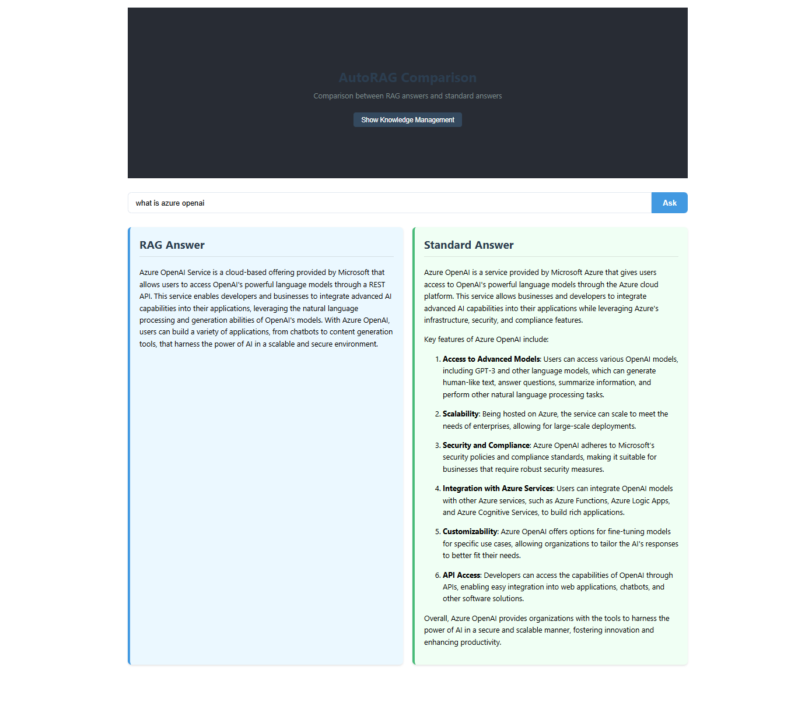
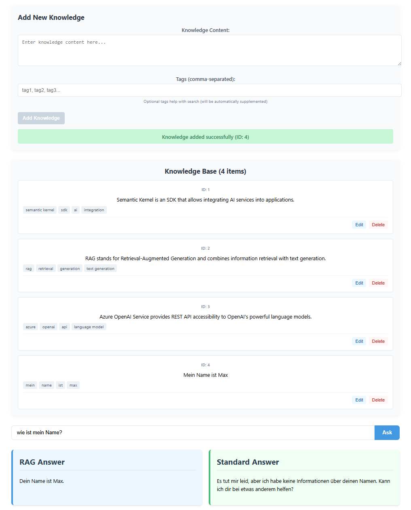

# FirstRAG - Simple RAG System

FirstRAG is a lightweight React application that demonstrates the concept of Retrieval-Augmented Generation (RAG) using the Azure OpenAI API. The application allows users to compare responses between RAG-enhanced answers (using a knowledge base) and standard LLM answers.



## Features

- **RAG System**: Uses a simple knowledge base to provide context-aware responses
- **Side-by-Side Comparison**: Compare answers with and without RAG to see the difference
- **Knowledge Management**: Add, edit, and delete custom knowledge in the system's knowledge base
- **Topic Classification**: Automatic detection of query domain for better responses
- **Relevance Scoring**: Ranks documents by relevance to the query

## Getting Started

### Prerequisites

- Node.js (v14 or higher)
- An Azure OpenAI Service subscription
- API access to GPT models on Azure

### Installation

1. Clone this repository:

```
git clone https://github.com/Ebiixx/first-rag-tests.git
cd FirstRAG
```

2. Install dependencies:

```
npm install
```

3. Create a `.env` file in the root directory with your Azure OpenAI credentials:

```
REACT_APP_GLOBAL_LLM_SERVICE="AzureOpenAI"
REACT_APP_AZURE_OPENAI_CHAT_DEPLOYMENT_NAME="your-gpt-deployment-name"
REACT_APP_AZURE_OPENAI_EMBEDDING_DEPLOYMENT_NAME="your-embedding-deployment-name"
REACT_APP_AZURE_OPENAI_ENDPOINT="https://your-resource-name.openai.azure.com/"
REACT_APP_AZURE_OPENAI_API_KEY="your-api-key"
```

4. Start the development server:

```
npm start
```

## How It Works

1. **Knowledge Base**: The system maintains a simple in-memory database of documents with content and tags.
2. **Query Processing**: When a user submits a question, the system:
   - Analyzes the query to determine its topic domain
   - Searches the knowledge base for relevant documents
   - Ranks documents by relevance score
   - Creates an optimized prompt that includes relevant context
3. **RAG Answer**: The system sends the context-enhanced prompt to the LLM to generate an informed answer
4. **Standard Answer**: In parallel, it sends a standard prompt without context to compare responses

## Knowledge Management

Users can manage the knowledge base directly through the interface:



- **Add Knowledge**: Enter new facts, documents, or information
- **Tag Content**: Add relevant tags to improve search accuracy
- **Edit Entries**: Update existing knowledge items as needed
- **Delete Entries**: Remove outdated or incorrect information

## Project Structure

- `/src/services/ragService.js` - Core RAG functionality and knowledge base management
- `/src/api.js` - Azure OpenAI API integration
- `/src/components/KnowledgeManager.jsx` - Component for managing the knowledge base
- `/src/components/KnowledgeAdder.jsx` - Simplified component for adding knowledge
- `/src/App.js` - Main application with UI for comparison and questioning

## Limitations

- The knowledge base is in-memory only and resets when the page refreshes
- Uses simple keyword matching instead of vector embeddings for retrieval
- Limited to pre-defined topic domains
- No document source tracking or citation capabilities

## Future Enhancements

- Implement vector embeddings for semantic search
- Add persistent storage for the knowledge base
- Improve the UI with result highlighting and source citations
- Add document upload capabilities (PDF, Word, etc.)
- Implement multi-step reasoning for complex queries

## License

This project is licensed under the MIT License. See the LICENSE file for details.
